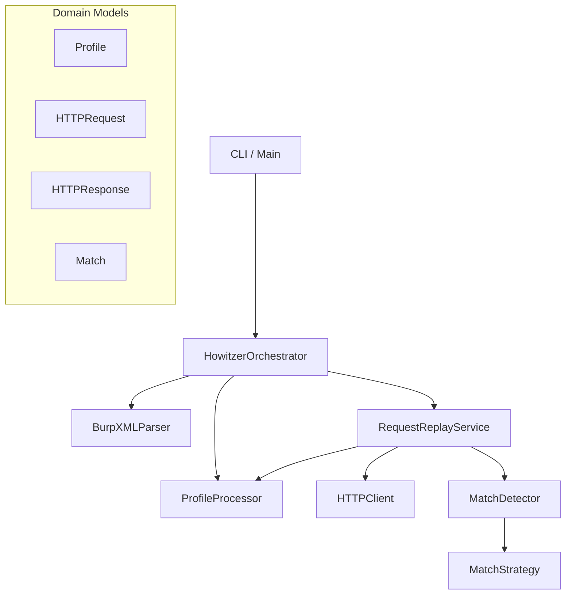
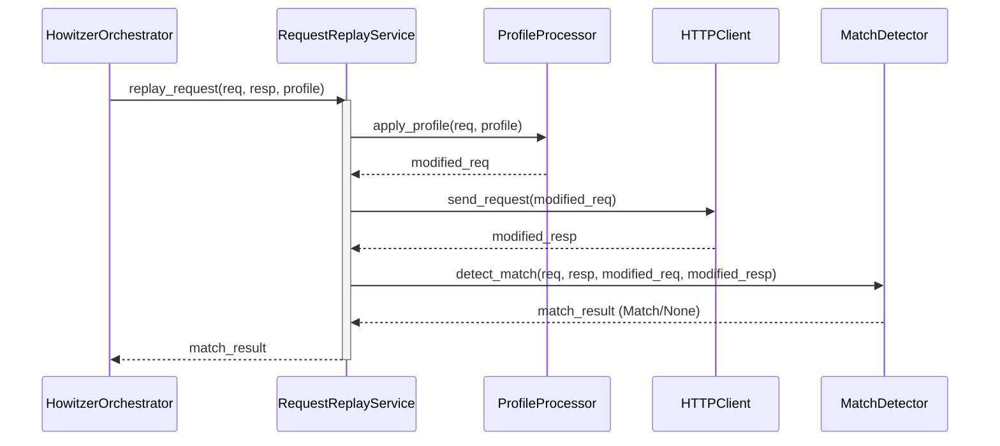

# Howitzer Architecture

This document describes the high-level architecture of the Howitzer security testing tool.

## High-Level Overview

Howitzer follows a layered architecture to separate concerns between CLI parsing, business logic, and external interactions.

## Components

### 1. Orchestration Layer
- **`HowitzerOrchestrator`**: The central coordinator. It manages the high-level workflow: parsing the input file, iterating through profiles, and collecting results. It handles exceptions and logging at the application level.

### 2. Service Layer
- **`RequestReplayService`**: Encapsulates the core logic of replaying a single request. It coordinates:
    1.  Applying the profile to the request.
    2.  Sending the modified request via `HTTPClient`.
    3.  Comparing the response using `MatchDetector`.
- **`ProfileProcessor`**: Manages loading profiles from configuration and applying them to `HTTPRequest` objects. It wraps the header manipulation logic.
- **`MatchDetector`**: Responsible for determining if an authorization bypass has occurred by comparing the original and replayed responses. It uses a Strategy pattern.

### 3. Infrastructure Layer
- **`BurpXMLParser`**: Parses Burp Suite XML exports into domain models.
- **`HTTPClient`**: A wrapper around `requests` that handles proxy configuration, timeouts, and SSL verification.
- **`HowitzerLogger`**: Provides structured logging capabilities.

### 4. Domain Models
- **`Profile`**: Configuration for a specific user role/context.
- **`HTTPRequest`**: Typed representation of an HTTP request.
- **`HTTPResponse`**: Typed representation of an HTTP response.
- **`Match`**: Represents a detected potential vulnerability.

## Request Replay Workflow

The following sequence diagram illustrates the flow of replaying a single request:

